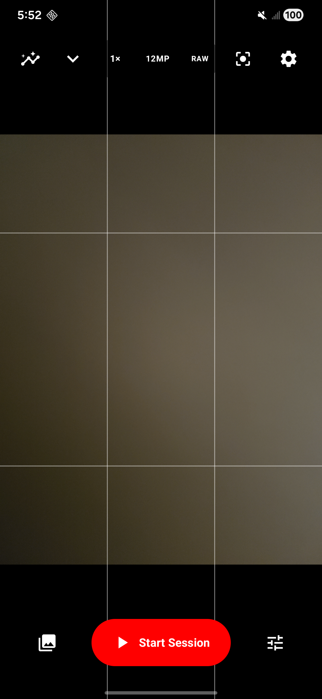
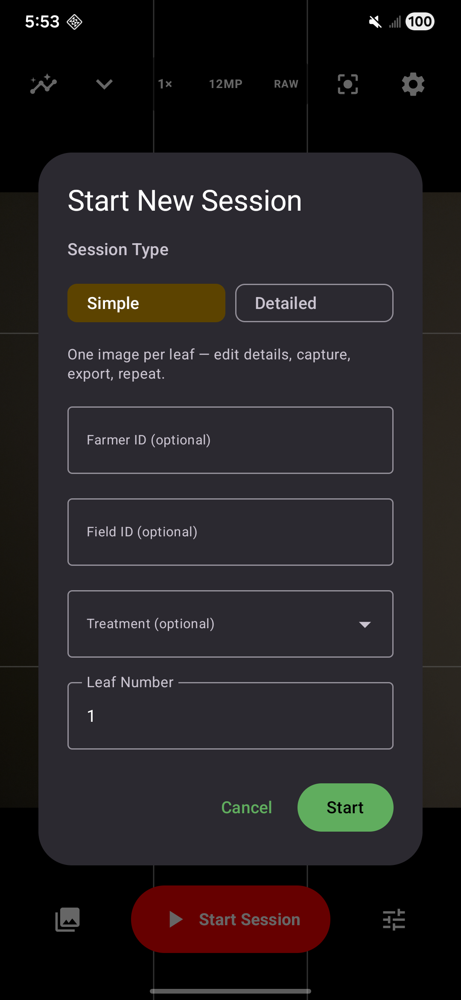
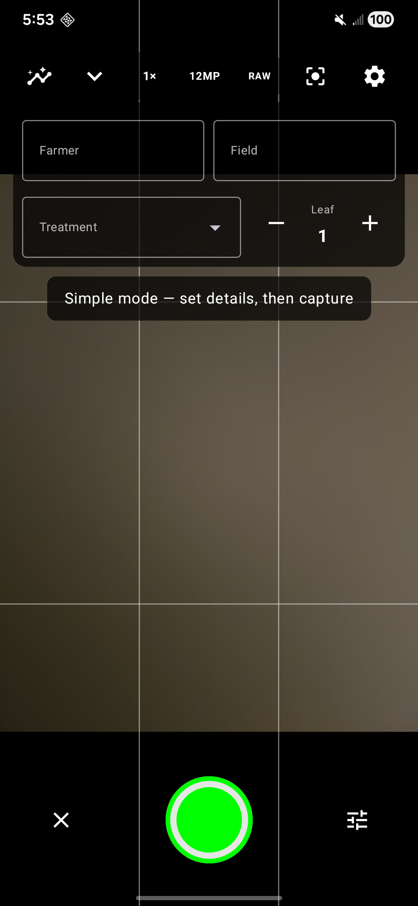
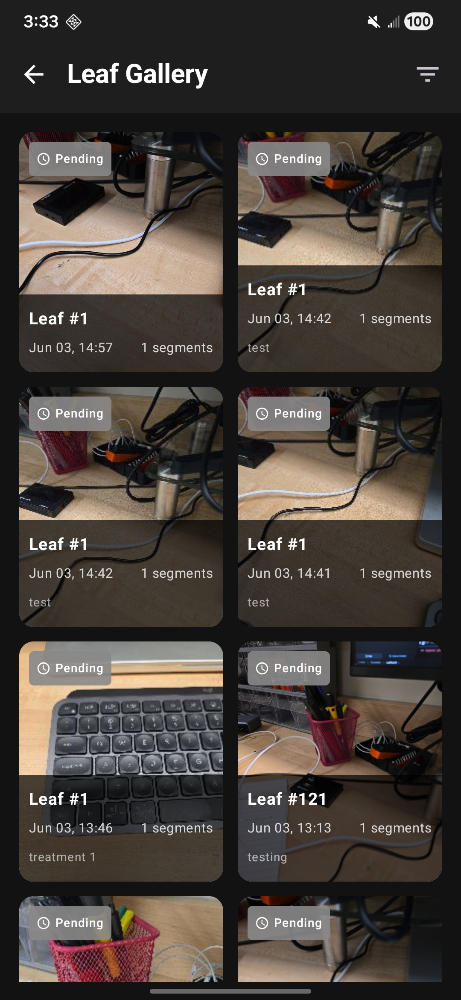
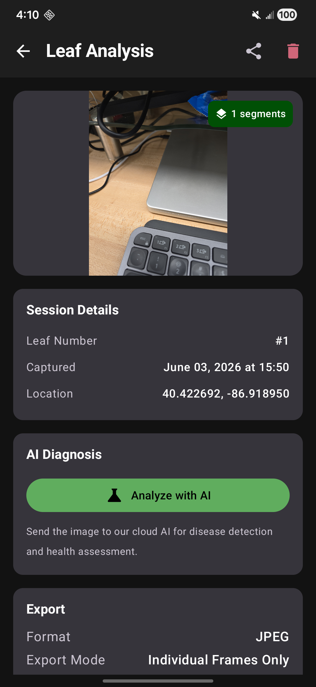
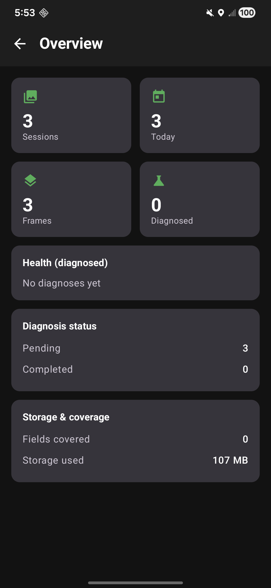

<div align="center">

# 🌿 LeafDoc

### Pro-grade field imaging & AI plant-health diagnosis for Android

Capture leaf and specimen images at maximum quality in the field — with full manual camera controls, structured metadata, GPS tagging, optional panorama stitching, and on-device-triggered **cloud AI disease diagnosis**.


 


</div>

---

## Overview

**LeafDoc** turns a phone into a scientific field-imaging instrument. It pairs a **professional manual camera** (built on CameraX + Camera2) with a **structured capture workflow** designed for agricultural and research fieldwork: tag every image with farmer / field / treatment / leaf metadata, auto-capture GPS coordinates, and choose exactly the quality and format you need — from max-quality JPEG to **lossless TIFF and RAW/DNG**.

Captured images can be **stitched** into a single leaf panorama and sent to **cloud AI** (Gemini, Claude, or GPT-4o) for disease detection and a health assessment, then exported to your phone's gallery for off-device analysis.

<div align="center">
<table>
  <tr>
    <td align="center"><br/><b>Pro capture</b></td>
    <td align="center"><br/><b>Session setup</b></td>
    <td align="center"><br/><b>Simple field mode</b></td>
  </tr>
  <tr>
    <td align="center"><br/><b>Gallery</b></td>
    <td align="center"><br/><b>Analysis & export</b></td>
    <td align="center"><br/><b>Overview dashboard</b></td>
  </tr>
</table>
</div>

---

## ✨ Features

### 📷 Professional camera
- **Full manual controls** — ISO, shutter speed, focus distance, white balance, exposure compensation, and flash/torch, via CameraX with Camera2 interop.
- **Lens & zoom selector** — proper zoom-ratio control (0.6× ultra-wide → telephoto) on modern multi-lens phones, just like the stock camera.
- **Focus controls** — Continuous / single-tap / Macro / Infinity / Manual modes, tap-to-focus with an on-screen ring, and AF-lock to hold focus between shots.
- **Live aids** — real-time histogram, composition grid overlays, and a **WYSIWYG preview** that matches the final image's aspect ratio.
- **Per-lens resolution picker** and **full-sensor maximum-resolution capture** via Camera2 `SENSOR_PIXEL_MODE` on devices that expose it.

### 🗂️ Capture formats
| Format | Type | Notes |
| --- | --- | --- |
| **JPEG** | 8-bit, lossy | Maximum quality (q100), universal |
| **PNG** | 8-bit, lossless | Compressed, lossless |
| **TIFF** | 8-bit, **uncompressed** | Lossless master for scientific analysis (custom baseline encoder, no dependency) |
| **RAW / DNG** | 10–16-bit sensor data | True uncompressed capture on RAW-capable devices |

### ⚡ Two field workflows
- **Simple mode** — one image per leaf, fast. An always-visible, editable metadata bar (Farmer / Field / Treatment / Leaf), capture → review → export → repeat.
- **Detailed mode** — capture multiple frames per specimen, optionally **stitch** into a panorama, and run AI diagnosis.

### 🏷️ Structured metadata
- Farmer ID, Field ID, **Treatment**, and Leaf number on every session.
- **User-managed pick lists** — build your own reusable Farmer/Field/Treatment options in Settings and choose them at capture time (or type a one-off).
- Automatic **GPS tagging** of each capture.

### 🧵 Image stitching
- Horizontal panorama stitching with linear gradient blending and **midrib alignment** (green-channel vein detection) to correct vertical drift between frames.

### 🤖 AI diagnosis
- Multi-provider via a clean strategy interface:

| Provider | Model |
| --- | --- |
| Google Gemini | `gemini-2.5-flash` (default) |
| Anthropic Claude | `claude-3-5-sonnet` |
| OpenAI | `gpt-4o` |

- Four tunable **prompt templates** — Quick check, Standard, Detailed pathology report, and Research-grade — specialized for corn diseases (Northern Corn Leaf Blight, Gray Leaf Spot, Common Rust, and more).
- Returns a structured health score, primary diagnosis, confidence, per-disease probabilities, and treatment suggestions. Re-analyze any image with a different model/prompt.

### 📊 Overview, gallery & export
- **Overview dashboard** — sessions, frames, captures today, diagnosed count, healthy-vs-issues breakdown, fields covered and storage used.
- **Gallery** of sessions with thumbnails and diagnosis status; tap to open full results.
- **Export** to the device gallery in JPEG / PNG / TIFF, single frame, all frames, or stitched — with lossless byte-copy for TIFF/DNG masters.

---

## 🛠️ Tech stack

- **Kotlin 2.0** · **Jetpack Compose** · **Material 3**
- **MVVM** architecture · **Hilt** dependency injection
- **CameraX 1.4** + **Camera2** interop (manual controls, RAW, max-resolution)
- **Room** (local persistence, schema-migrated) · **DataStore** (preferences)
- **Coil** (image loading) · **OkHttp / Retrofit / Gson** (AI APIs) · **Coroutines + Flow**
- **Google Generative AI SDK** · **Timber** logging
- Min SDK 26 · Target SDK 35

---

## 🏗️ Architecture

```
com.leafdoc.app/
├── camera/        # CameraX + Camera2 controller, high-res / RAW capture engine
├── stitching/     # Panorama stitcher + midrib aligner
├── data/
│   ├── model/     # Room entities & data classes
│   ├── local/     # Room database, DAOs, migrations
│   ├── remote/ai/ # AI provider abstraction (Gemini / Claude / ChatGPT) + prompts
│   ├── repository/# Session, image, and diagnosis repositories
│   └── preferences/# DataStore settings & saved lists
├── di/            # Hilt modules
├── ui/            # Compose screens: camera, gallery, results, dashboard, settings
├── navigation/    # Compose Navigation graph
└── util/          # TIFF encoder, location, helpers
```

---

## 🚀 Getting started

### Prerequisites
- Android Studio (bundled JDK 17) and an Android device/emulator (SDK 26+).
- At least one AI provider API key (optional, only needed for diagnosis).

### 1. Configure API keys
Copy the example and add your key(s) — `local.properties` is **not** committed:

```properties
# local.properties
GEMINI_API_KEY=your_gemini_key_here
CLAUDE_API_KEY=your_anthropic_key_here
CHATGPT_API_KEY=your_openai_key_here
```

Get keys from [Google AI Studio](https://aistudio.google.com/apikey), the [Anthropic Console](https://console.anthropic.com/), or the [OpenAI Platform](https://platform.openai.com/).

### 2. Build & run

```bash
# Debug APK
./gradlew assembleDebug

# Install on a connected device
./gradlew installDebug
```

---

## 📝 Notes

- **Full-sensor 50/200 MP capture** depends on the device exposing the standard Camera2 maximum-resolution path. Some manufacturers (e.g. Samsung) gate their highest-resolution mode behind a vendor SDK; on those devices LeafDoc captures the device's standard maximum and offers **RAW/DNG** as the uncompressed alternative.
- TIFF and RAW/DNG masters can't be decoded for in-app preview by Android, so the app shows a JPEG proxy for those frames while preserving the lossless file for export.

---

<div align="center">
Built with Jetpack Compose · CameraX · Room · Hilt
</div>
