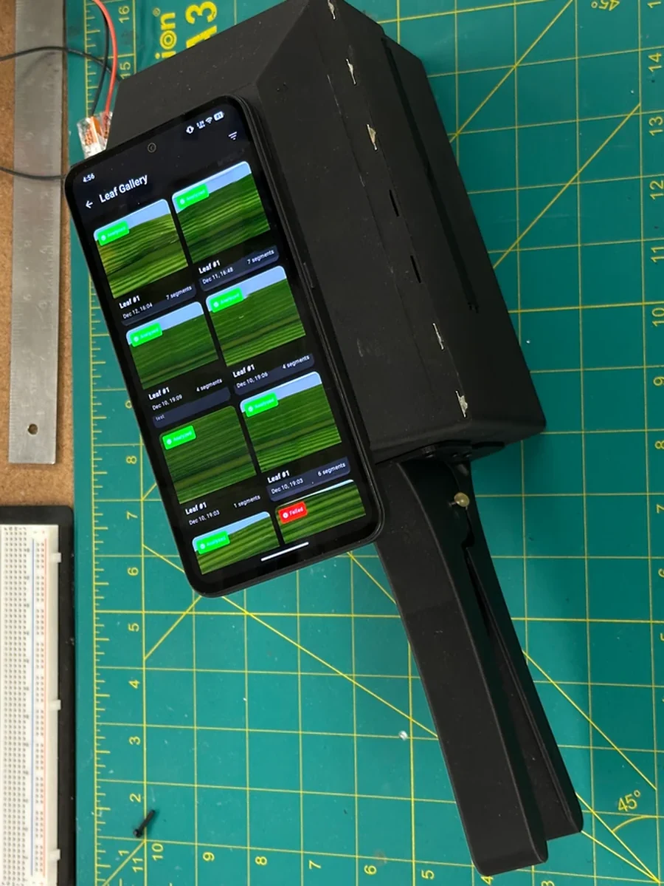
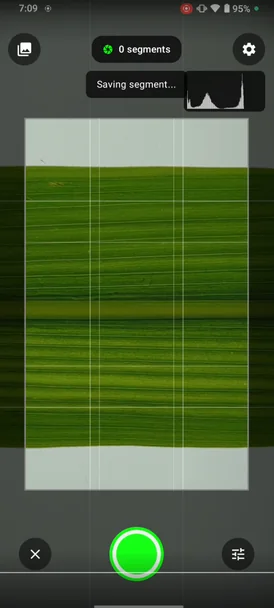
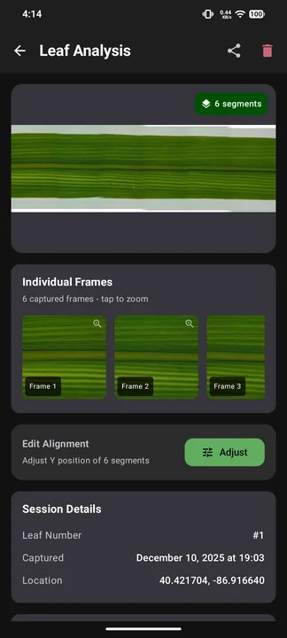
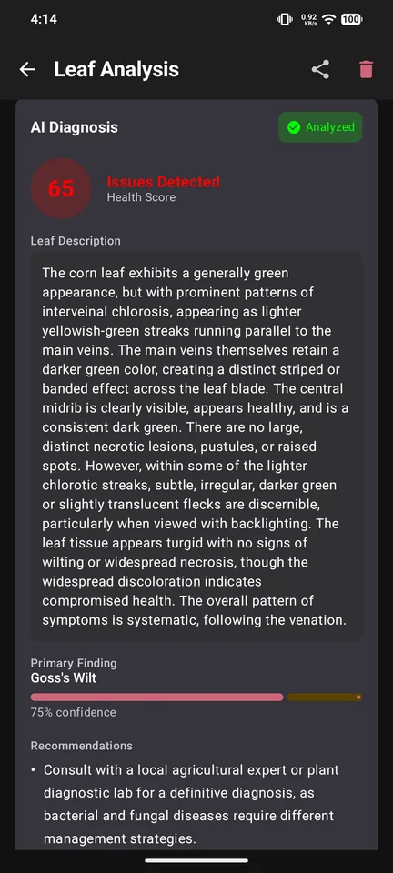
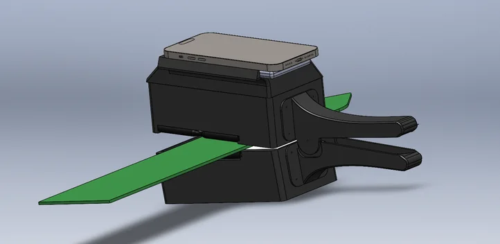
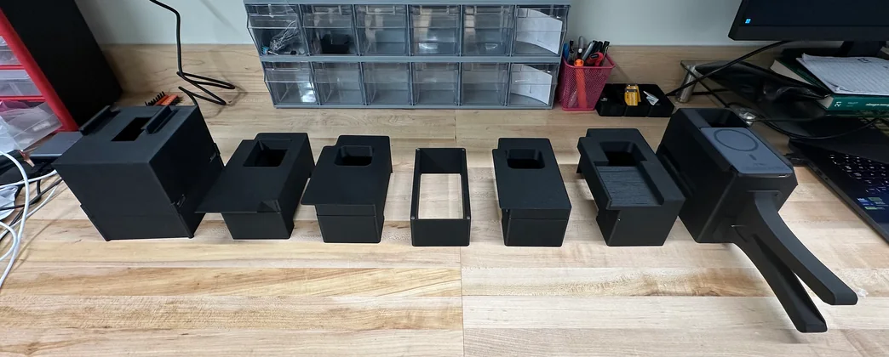
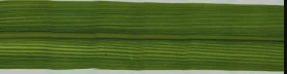

<div align="center">

# LeafDoc

**A professional field-imaging and plant-health diagnosis tool for Android**

Backlit leaf imaging at maximum quality in the field — a purpose-built handheld enclosure, full manual camera control, structured trial metadata, GPS tagging, lossless capture formats, and optional cloud AI disease diagnosis.



[](#requirements)
[](#technology-stack)
[](#technology-stack)
[](#requirements)
[](#requirements)
[](#architecture)

</div>

---

## Overview

LeafDoc turns an Android phone into a repeatable field-imaging instrument for agronomic trials and plant pathology work. A 3D-printed handheld enclosure clamps over a leaf and backlights it, so the phone captures the leaf in **transmittance** — light passing *through* the blade rather than reflecting off it. Interveinal chlorosis, water-soaked lesions, and mesophyll damage that are ambiguous in a reflected-light photograph become clearly visible, and the fixed geometry means every image in a trial is captured at the same distance, angle, and illumination.

The application supplies the rest: manual exposure and focus control built on CameraX and Camera2, a structured capture workflow in which every image is tagged with farmer, field, treatment, and leaf identifiers and stamped with GPS coordinates, and a choice of capture format — from maximum-quality JPEG to lossless TIFF or RAW/DNG.

A leaf longer than the imaging window is captured as a sequence of frames, which can then be stitched into a single continuous panorama, submitted to a cloud vision model for disease assessment, and exported to the device gallery for downstream analysis.

The design goal throughout is repeatable data collection rather than casual photography: the imaging geometry, the metadata schema, the capture formats, and the export paths are all chosen so that images leaving the device remain usable as scientific records.

<div align="center">
<table>
  <tr>
    <td align="center"><br/><b>Backlit capture with live histogram</b></td>
    <td align="center"><br/><b>Stitched result and source frames</b></td>
    <td align="center"><br/><b>AI diagnosis</b></td>
  </tr>
</table>
</div>

---

## The imaging device

LeafDoc is designed around a companion handheld enclosure. A spring-loaded clamp holds the leaf flat against a backlit window; the phone mounts on top, aligned so the camera looks directly down onto the illuminated section of blade. The leaf is drawn through the slot to image successive sections, which the application captures as separate frames and later stitches into one continuous image.

<div align="center">

</div>

Holding the optics fixed is what makes the imagery comparable: constant working distance, constant illumination, and a leaf held flat and square to the sensor. It also removes the two variables that make field leaf photographs hard to score — ambient lighting and camera angle.

The enclosure went through several print revisions before the current clamp-and-handle design:

<div align="center">

</div>

> The application does not require the enclosure — any backlit leaf will do, and the camera works handheld — but the prompt templates and the stitching workflow both assume transmittance imagery. Mechanical design files are not part of this repository.

---

## Features

### Manual camera control

- **Exposure controls** — ISO, shutter speed, exposure compensation, white-balance presets, and flash/torch, exposed through CameraX with Camera2 interoperability.
- **Zoom-based lens selection** — a zoom-ratio selector (0.6× ultra-wide through the device's telephoto range) rather than camera-ID switching, matching how modern multi-lens phones fuse their sensors.
- **Focus modes** — continuous, single-shot (tap), macro, infinity, and manual focus distance, plus tap-to-focus with an on-screen ring and AF lock to hold focus between frames.
- **Composition aids** — live luminance histogram and selectable grid overlays (rule of thirds, golden ratio, centre cross, 4×4) over a WYSIWYG preview that matches the captured aspect ratio.
- **Resolution selection** — per-lens resolution picker, including full-sensor maximum-resolution capture through the Camera2 `SENSOR_PIXEL_MODE` path on devices that expose it.

### Capture formats

| Format | Bit depth | Lossless | Notes |
| --- | --- | --- | --- |
| JPEG | 8-bit | No | Maximum quality (q100); universally readable |
| PNG | 8-bit | Yes | Lossless, compressed |
| TIFF | 8-bit | Yes | Uncompressed master written by a self-contained baseline TIFF encoder (no third-party dependency) |
| RAW / DNG | Sensor native | Yes | Camera2 `RAW_SENSOR` capture via `DngCreator` on RAW-capable lenses; enabled from the camera toolbar |

Android cannot decode TIFF or DNG, so LeafDoc generates a JPEG proxy for in-app preview and AI analysis while preserving the original file byte-for-byte on export.

### Two field workflows

- **Simple mode** — one image per leaf. An always-visible metadata bar (farmer / field / treatment / leaf) sits above the viewfinder; capture, review, export, and repeat without leaving the camera.
- **Detailed mode** — capture multiple frames per specimen, typically successive sections of a leaf drawn through the imaging slot, and save them as an un-stitched session. Panorama stitching is an explicit action from the results screen rather than an automatic step, so the original frames always remain the source of record.

### Structured metadata

- Farmer ID, field ID, treatment, and leaf number recorded on every session.
- **User-managed pick lists** — build reusable farmer, field, and treatment options in Settings and select them at capture time, or enter a one-off value.
- Automatic GPS coordinates captured alongside each session.

### Image stitching

Horizontal panorama stitching with linear gradient blending, plus optional midrib alignment that detects the leaf vein in the green channel and corrects vertical drift between frames. Per-frame vertical offsets can also be adjusted by hand before the stitch is committed.

<div align="center">

<br/><sub>Six backlit frames stitched into a single continuous leaf</sub>
</div>

### AI diagnosis

Diagnosis is provided by a pluggable provider interface, so the analysis model is a user setting rather than a build-time decision.

| Provider | Model configured in code |
| --- | --- |
| Google Gemini | `gemini-2.5-flash` (default provider) |
| Anthropic Claude | `claude-sonnet-5` |
| OpenAI | `gpt-4o` |

Four prompt templates — quick check, standard analysis, detailed pathology report, and research-grade — share a common corn-disease reference set and a single JSON output contract, so results are directly comparable across providers and templates. All four are written specifically for transmittance imagery: they instruct the model to read the symptoms that backlighting reveals, such as interveinal chlorosis, translucent flecking, and water-soaked lesions, rather than surface appearance alone. Every analysis returns a health score, a primary diagnosis with a confidence value, per-disease probabilities, and treatment recommendations. Any image can be re-analysed with a different provider or template.

### Review, gallery, and export

- **Overview dashboard** — session and frame counts, captures today, diagnosed versus pending, healthy-versus-issues breakdown, fields covered, and on-device storage used.
- **Session gallery** — thumbnail grid with diagnosis status and filtering; tap through to full results.
- **Export** — write to the device gallery as JPEG, PNG, or TIFF, choosing a single frame, all frames, or the stitched image. TIFF and DNG masters are byte-copied rather than re-encoded.

---

## Requirements

- Android Studio (bundled JDK 17) and an Android device or emulator running API 26 or later.
- JDK 17 on `JAVA_HOME` if building from the command line.
- At least one AI provider API key — optional, and required only for diagnosis. The application builds and runs without any key.

## Getting started

### 1. Configure API keys

Copy `local.properties.example` to `local.properties` and add the keys you intend to use. `local.properties` is git-ignored and is never committed.

```properties
GEMINI_API_KEY=your_gemini_key_here
CLAUDE_API_KEY=your_anthropic_key_here
CHATGPT_API_KEY=your_openai_key_here
```

Keys are exposed to the application through `BuildConfig` at build time. Obtain them from [Google AI Studio](https://aistudio.google.com/apikey), the [Anthropic Console](https://console.anthropic.com/), or the [OpenAI Platform](https://platform.openai.com/). See [AI_PROVIDERS_SETUP.md](AI_PROVIDERS_SETUP.md) for provider comparison and troubleshooting.

### 2. Build and run

```bash
./gradlew assembleDebug     # Build a debug APK
./gradlew installDebug      # Build and install on a connected device
./gradlew assembleRelease   # Release build (minification and resource shrinking enabled)
./gradlew test              # Run JVM unit tests
```

On Windows, use `gradlew.bat`. Both wrapper scripts are committed.

---

## Architecture

LeafDoc uses MVVM with Jetpack Compose, Hilt dependency injection, Room persistence, and Kotlin coroutines and Flow throughout.

```
com.leafdoc.app/
├── camera/        # ProCameraController (CameraX + Camera2), HighResCaptureEngine, FrameAnalyzer
├── stitching/     # SimpleStitcher, MidribAligner
├── data/
│   ├── model/     # Room entities, capture and camera enums
│   ├── local/     # Room database, DAOs, schema migrations
│   ├── remote/ai/ # AiProvider interface, provider implementations, prompt library
│   ├── repository/# Session, image, and diagnosis repositories
│   └── preferences/# DataStore-backed settings and saved pick lists
├── di/            # Hilt modules
├── ui/            # Compose screens: camera, gallery, results, dashboard, settings
├── navigation/    # Compose Navigation graph
└── util/          # TIFF encoder, location services
```

Data model: a `LeafSession` owns one or more `LeafSegment` rows (cascade delete). The Room schema is at version 3 with explicit migrations for every change; destructive migration is deliberately disabled so that field data is never silently discarded on upgrade.

For the design of the multi-provider diagnosis layer, see [ARCHITECTURE_MULTI_PROVIDER_AI.md](ARCHITECTURE_MULTI_PROVIDER_AI.md).

## Technology stack

| Area | Libraries |
| --- | --- |
| Language and UI | Kotlin 2.0.21, Jetpack Compose (BOM 2024.11.00), Material 3 |
| Architecture | MVVM, Hilt 2.52, Navigation Compose, Coroutines 1.9, Flow |
| Camera | CameraX 1.4.0, Camera2 interop |
| Persistence | Room 2.6.1 (schema-exported, migrated), DataStore Preferences 1.1.1 |
| Networking | OkHttp 4.12, Retrofit 2.11, Gson 2.11, Google Generative AI SDK 0.9.0 |
| Media and utilities | Coil 2.7, AndroidX ExifInterface, Play Services Location, Timber |
| Build | AGP 8.7.2, KSP, JDK 17, compile/target SDK 35, min SDK 26 |

---

## Permissions

| Permission | Purpose |
| --- | --- |
| `CAMERA` | Image capture |
| `ACCESS_FINE_LOCATION`, `ACCESS_COARSE_LOCATION` | GPS tagging of sessions |
| `READ_MEDIA_IMAGES`, scoped legacy storage permissions | Reading and exporting images to the shared gallery |
| `INTERNET`, `ACCESS_NETWORK_STATE` | Cloud AI diagnosis requests |

## Data handling

Images and metadata are stored locally on the device; there is no LeafDoc backend service. When AI diagnosis is invoked, the selected frame — as a JPEG, downscaled where required by the provider's limits — is transmitted to the chosen third-party provider, along with the prompt text and, where present, the session's GPS coordinates. No image leaves the device unless the user explicitly starts an analysis. Review the privacy terms of any provider you enable before using LeafDoc with sensitive trial data.

## Known limitations

- **Full-sensor 50/200 MP capture** depends on the device exposing the standard Camera2 maximum-resolution stream map. Several manufacturers gate their highest-resolution mode behind a vendor SDK; on those devices LeafDoc captures the device's standard maximum and offers RAW/DNG as the uncompressed alternative.
- **TIFF and RAW/DNG masters cannot be decoded by Android**, so in-app preview and AI analysis operate on a JPEG proxy. Exported masters are unaffected.
- **Focus peaking and zebra (overexposure) toggles** are present in Settings and their analysers are implemented, but the corresponding preview overlays are not yet drawn.
- **The project currently has no automated test suite**; `./gradlew test` succeeds with no tests to run.

## Troubleshooting

| Symptom | Resolution |
| --- | --- |
| `Unable to locate a Java Runtime` from `./gradlew` | Point `JAVA_HOME` at a JDK 17 installation — Android Studio's bundled JBR works. |
| `INSTALL_FAILED_UPDATE_INCOMPATIBLE` on `installDebug` | A build signed with a different debug keystore is installed. Run `adb uninstall com.leafdoc.app` and reinstall. In-app sessions are lost; exported gallery files are not. |
| A provider shows "NOT CONFIGURED" in Settings | The corresponding key is missing from `local.properties`. Add it and rebuild — keys are compiled in through `BuildConfig`. |

## License

No license has been declared for this repository. Until a `LICENSE` file is added, default copyright applies and the code carries no grant of reuse.

---

<div align="center">
Built with Jetpack Compose, CameraX, Room, and Hilt.
</div>
